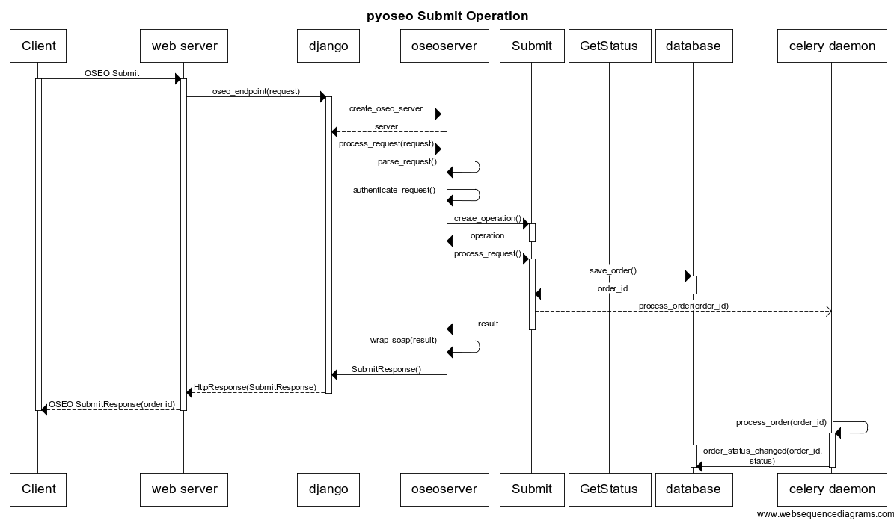

Introduction
============

Overview
--------

pyoseo is an ordering server. It processes requests for spatial data and makes
the data available to the requesting user upon completion.

It implements the OGC OSEO standard. OSEO stands for Ordering Services
Framework for Earth Observation Products. The standard defines interfaces,
bindings and requirements for establishing a workflow for ordering of Earth
Observation data between a server and client.

An effective OSEO server needs to implement the following components:

* web server - listens to incoming requests, passes them to the oseo engine 
  for processing. Issues the appropriate response back to the client;
* oseo engine - Parses the requests and build responses according to the OSEO
  standard;
* database - records every order and associated parameters. Tracks an order's
  state as it gets processed as well as associated data;
* queueing system - A process that is continuously running, preparing orders as
  they are requested. Order processing is asynchronous;
* order processing module - A set of tasks that perform the actual processing
  of each ordered item;
* authentication framework - Ensures that the client that made the request has
  the necessary permissions to use the server;
* order delivery module - Makes the ordered items available to the client after
  they have been processed.

.. graphviz::

   graph pyoseo_components {
       "web server" [shape = "box" style = "rounded"];
       "oseo engine" [shape = "box" style = "rounded"];
       "queueing system" [shape = "box" style = "rounded"];
       "database" [shape = "box" style = "rounded"];
       "authentication framework" [shape = "box" style = "rounded, dashed"];
       "order processing module" [shape = "box" style = "rounded, dashed"];
       "order delivery module" [shape = "box" style = "rounded, dashed"];
       "web server" -- "oseo engine";
       "oseo engine" -- "database";
       "oseo engine" -- "queueing system";
       "oseo engine" -- "authentication framework";
       "queueing system" -- "database";
       "queueing system" -- "order processing module";
       "order processing module" -- "order delivery module";
   }

Some of these components are specific to each particular implementation. As
such, instead of trying to cater to every possible situation, pyoseo provides
hooks into these modules and leaves their concrete implementation to each
particular instance. This means that the following components are not provided
by pyoseo and **must** be implemented independently:

* Authentication framework. Check the :doc:`customauth` page for more details;
* Order processing and delivery modules. Check the :doc:`customprocessing` page
  for more details.

Implementation
--------------

Pyoseo is implemented in Python. It essentially glues together some widely used
python libraries, harnessing their power to bring the OSEO standard into
fruition:

* The *web server* and *database* components are essentially a `django`_ 
  project
* The *queueing system* component uses `celery`_
* Parsing, validating and creation of OSEO elements is done with `pyxb`_ and
  `lxml`_

.. _django: http://www.djangoproject.com
.. _celery: http://www.celeryproject.com
.. _pyxb: http://pyxb.sourceforge.net/
.. _lxml: http://lxml.de/

So we basically have a django project running, listening for HTTP POST
requests. There is an :func:`~oseoserver.views.oseo_endpoint` view
that instantiates the :class:`~oseoserver.server.OseoServer` class. This class
then proceeds to:

* Parse the request, 
* Authenticate the request by calling the :doc:`external authentication class <customauth>`
* Instantiate a specialized :ref:`OSEO operation class <oseo-operations-label>`
* Receive the response from the OSEO operation class and return it to the
  django view, who then returns it to the web server

An :ref:`OSEO operation class <oseo-operations-label>` is tasked with 
processing the request. Depending on the request, this class will communicate
with the database, creating, updating or querying order records and order 
items. It will also communicate with the celery workers by issuing processing 
tasks.

When a processing task gets scheduled for execution, it retrieves the order's
relevant parameters from the database and then calls the 
:doc:`external processing class <customprocessing>`, which is responsible for
actually fetching the ordered items, applying any requested options. The
processing class will also perform the delivery of the items to the specified
endpoint.

The following sequence diagram depicts an outline of pyoseo's generic workflow,
upon receiving a request:

In short, when a Submit request is made:

* The web server sends the request to the 
  :func:`oseoserver.views.oseo_endpoint` django view. This view validates
  that the HTTP request is of type POST and then instantiates an
  :class:`oseoserver.server.OseoServer` instance.
* The instantiated server receives the request and authenticates the user 
  by calling its own :func:`oseoserver.server.OseoServer.authenticate_request`
  method.
* Based on the type of OSEO request received, the server creates an 
  appropriate processing class. For Submit requests, the server instantiates
  a :class:`oseoserver.operations.submit.Submit` object to do the processing.
* Processing of a Submit order breaks down to:

  * Inserting a new record for the order in the database. Order records are of
    type :class:`oseoserver.models.Order`
  * Sending the order to the celery queue, where it will be processed as one of
    the tasks defined in :mod:`oseoserver.tasks`

.. _oseo-operations-label:

OSEO operations
---------------

The following operations are currently implemented:

.. toctree::
   :maxdepth: 2

   getcapabilities
   getoptions
   getquotation
   getquotationresponse
   submit
   submitresponse
   getstatus
   describeresultaccess
   cancel
   cancelresponse
