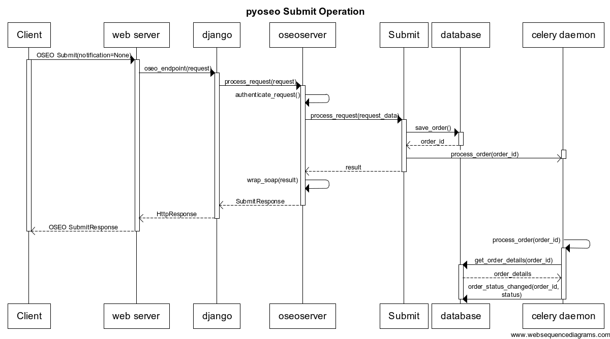

Introduction
============

pyoseo is an ordering server. It processes requests for spatial data and makes
the data available to the requesting user upon completion.

It implements the OGC OSEO standard. OSEO stands for Ordering Services
Framework for Earth Observation Products. The standard defines a interfaces,
bindings and requirements for establishing a workflow for ordering of Earth
Observation data between a server and client.

In short, PyOSEO stands between the data products and its clients. It receives
order requests, process them and makes the resultant order items available to
its client.

The server listens for order requests that arrive via HTTP POST messages,
wrapped in a SOAP header.

GetOptions operation
--------------------

For more info refer to section ?? of the OSEO specification

Submit operation
----------------

The Submit operation is the method that the client can call in order to place
an order on the server.

Submit requests can request one of:

* normal order
* massive order (Not implemented yet)
* subscription order (Not implemented yet)
* tasking request order (Not implemented yet)

Submit requests can take the form of:

* normal order specification
* order via quotation identifier (Not implemented yet)

Upon receiving such a request, the server will store the order request in the
database with an initial status of ???. The order is then sent to a processing
queue, where it will be processed in due time. This means that Submit is an
asynchronous operation.
Depending on the request, the server can reply back in one of three ways:

* the server ankowledges the ordering request but will not try to contact the
  client to notify it of further status changes regarding the order
* the server actively notifies the client of every status change regarding the
  order. This method is not currently implemented in pyoseo.
* the server notifies the client when the order has been processed and is
  ready. This method is not currently implemented in pyoseo.

The following sequence diagram depicts an outline of pyoseo's implementation of
the Submit operation.

For more info refer to section 12 of the OSEO specification.

An example Submit request could be

.. code:: xml

   <soapenv:Envelope xmlns:soapenv="http://schemas.xmlsoap.org/soap/envelope/" xmlns:add="http://www.w3.org/2005/08/addressing" xmlns:ns="http://www.opengis.net/oseo/1.0"
   xmlns:wsse="http://docs.oasis-open.org/wss/2004/01/oasis-200401-wss-wssecurity-secext-1.0.xsd">
      <soapenv:Header>
          <!-- SOAP headers here -->
      </soapenv:Header>
      <soapenv:Body>
         <ns:Submit service="OS" version="1.0.0">
            <ns:orderSpecification>
               <ns:orderReference>Test reference</ns:orderReference>
               <ns:orderRemark>A remark</ns:orderRemark>
               <ns:deliveryOptions>
                  <ns:onlineDataAccess>
                     <ns:protocol>ftp</ns:protocol>
                  </ns:onlineDataAccess>
               </ns:deliveryOptions>
               <ns:orderType>PRODUCT_ORDER</ns:orderType>
               <ns:orderItem>
                  <ns:itemId>item_01</ns:itemId>
                  <ns:productId>
                     <ns:identifier>01729024-8dba-11e3-b102-0019995d2a58</ns:identifier>
                  </ns:productId>
               </ns:orderItem>
               <ns:orderItem>
                  <ns:itemId>item_02</ns:itemId>
                  <ns:productId>
                     <ns:identifier>96aa298c-c9d7-11e3-89f2-0019995d2a58</ns:identifier>
                  </ns:productId>
               </ns:orderItem>
            </ns:orderSpecification>
            <ns:statusNotification>None</ns:statusNotification>
         </ns:Submit>
      </soapenv:Body>
   </soapenv:Envelope>

Here the client is asking the server to perform a Submit operation, creating
a normal product order that has two order items. Each item is identified by its
corresponding id in the OGC CSW catalogue server where the data records are
stored. PyOSEO can track down order items according to their id from wherever
it is told to. See the section on processing orders for more information on
this topic.

Upon receiving such a request, pyoseo's response will be something like

.. code:: xml

   <soap:Envelope xmlns:soap="http://schemas.xmlsoap.org/soap/envelope/" xmlns:ows="http://www.opengis.net/ows/2.0">
      <soap:Body>
         <ns1:SubmitAck xmlns:ns1="http://www.opengis.net/oseo/1.0">
            <ns1:status>success</ns1:status>
            <ns1:orderId>211</ns1:orderId>
         </ns1:SubmitAck>
      </soap:Body>
   </soap:Envelope>

This response means that pyoseo has aknowledged the order. The order has been
assigned an id, it has been stored in the order database and has been sent to
the order processing daemon, which queues the order for processing as soon as
there are available processing resources.

Getstatus operation
-------------------

For more info refer to section ?? of the OSEO specification

DescribeResultAccess operation
------------------------------

For more info refer to section ?? of the OSEO specification
Cancel operation
----------------

For more info refer to section ?? of the OSEO specification

GetCapabilities - Not implemented
GetQuotation - Not implemented
GetQuotationResponse - Not implemented
SubmitResponse - Not implemented
CancelResponse - Not implemented

How it works internally
-----------------------

pyoseo is composed of the following parts:

* web server - listens to incoming requests and issues replies
* database - records every order and associated parameters. Tracks an order's
  state as it gets processed
* queueing system - A process that is continuously running, preparing orders as
  they are requested. Order processing is asynchronous.

.. graphviz::

   digraph pyoseo_components {
       "client" -> "web server";
       "web server" -> "database";
       "database" -> "queueing system";
   }
